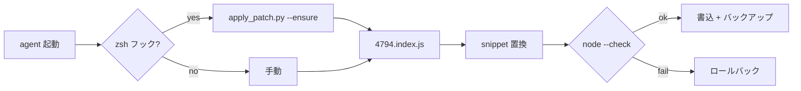

<p align="center">
  <a href="README.md">English</a> ·
  <a href="README.ko.md">한국어</a> ·
  <a href="README.ja.md"><strong>日本語</strong></a> ·
  <a href="README.zh-CN.md">简体中文</a> ·
  <a href="README.zh-TW.md">繁體中文</a>
</p>

<p align="center">
  
</p>

<h1 align="center">cursor-cli-input-patch</h1>

<p align="center">
  <strong><a href="https://cursor.com/docs/cli/overview">Cursor CLI</a> Unicode 入力パッチ</strong><br>
  <sub>単語移動 · 空行スクロール · ローカル · 可逆 · 非公式</sub>
</p>

<p align="center">
  <a href="LICENSE"></a>
  
  
  
</p>

<br>

> **名称:** 製品名は [**Cursor CLI**](https://cursor.com/cli)。実行コマンドは **`agent`**（`cursor-agent` はレガシー alias）。ローカルインストールのみパッチし、Cursor バイナリは同梱しません。

<table>
<tr>
<td width="50%" valign="top">

### パッチ前

**`agent`** プロンプトで:

- **Option/Alt + ← / →**（macOS）または **Ctrl + ← / →** が `[A-Za-z0-9_]` のみ「単語」扱い
- ソフト折り返し URL/パス **上の空行で ↑** するとスクロールが飛ぶ

</td>
<td width="50%" valign="top">

### パッチ後

- `Intl.Segmenter`（`granularity: "word"`, ランタイム既定ロケール）
- 空行・折り返し EOL が正しい視覚行にマップ

</td>
</tr>
</table>

<p align="center">
  
</p>

<br>

## 影響する言語・ユーザー

CJK 限定ではありません:

| Fix | 影響 |
|:----|:-----|
| **Option/Ctrl + ← / →** | **`[A-Za-z0-9_]` 外** — 韓国語、日本語、中国語、キリル、アラビア語、ヘブライ語、タイ語、ギリシャ語、デーヴァナーガリー、アクセント付きラテン（`café`）など。素の ASCII 英語は概ね問題なし。[Codex CLI #16584](https://github.com/openai/codex/issues/16584) 等と同種 |
| **折り返し行上の空行で ↑** | **言語非依存** — 長い URL、パス、soft-wrap + 上の空行 |

韓国語/CJK 発のパッチですが、stock ASCII regex が飛ばす **あらゆる文字体系** に効きます。

<br>

## クイックスタート

```bash
git clone https://github.com/vzts/cursor-cli-input-patch.git
cd cursor-cli-input-patch
python3 tests/test_behavior.py
python3 apply_patch.py
python3 apply_patch.py --install   # 任意: zsh フック
```

パッチ後 **`agent`**（または legacy **`cursor-agent`**）を再起動。

<details>
<summary><strong>必要環境</strong></summary>

<br>

- **Python 3**、**Node.js**、**macOS**（IDE worker パス）
- **Cursor CLI** インストール済み: `curl https://cursor.com/install -fsS | bash`
- **`--install`** — **zsh のみ**（`~/.zshrc`）。bash/fish は手動実行

</details>

<br>

## パッチ対象

**`4794.index.js`** のみ。

| | |
|:--|:--|
| **単語移動** | ASCII helper → `Intl.Segmenter` |
| **空行** | `findLine` 修正 |

```
~/.local/share/cursor-agent/versions/<最新>/
~/Library/Application Support/Cursor/.../cursor-agent-worker/.../versions/<最新>/
```

`--no-worker` で CLI のみ可能。

<br>

## パッチしない

| 領域 | 理由 |
|:-----|:-----|
| 通常 **← / →** | NFC ハングルは UTF-16 で 1 音節 — 不要 |
| **Backspace / Delete** (grapheme) | 同上 |
| CJK **表示幅 ↑ / ↓** | 1 列/コードポイント、幅 2 は誤着地 |
| **IME** 候補 | `agent` ハング — 削除 |

**escape sequence でターミナルカーソルは動かしません。**

<br>

## コマンド

```bash
python3 apply_patch.py              # CLI + worker
python3 apply_patch.py --install    # zsh フック + ~/.local/bin ラッパ + LaunchAgent
python3 apply_patch.py --ensure     # 済みなら静かに; ラッパ修復; 不一致は警告後 exit 0
python3 apply_patch.py --restore
python3 apply_patch.py --list-backups
python3 apply_patch.py --dry-run -v
python3 apply_patch.py --no-worker
```

<details>
<summary><strong>CLI 更新 · バックアップ · 再インストール</strong></summary>

<br>

更新でバージョンフォルダが差し替わり `~/.local/bin/agent` が symlink に戻ります。**`--install`** で LaunchAgent が `--ensure`（パッチ + ラッパ修復）を再実行。`agent` 起動時も bin ラッパが `--ensure` を呼びます。バックアップ: `~/.local/share/cursor-cli-input-patch/backups/`（旧パスは自動移行）。

不一致時 **fail closed**。**`--ensure`** は警告後 `agent` 起動可。最終手段: `curl https://cursor.com/install -fsS | bash`

</details>

<br>

## 動作フロー



<br>

## テスト

```bash
python3 tests/test_behavior.py
python3 tests/test_pty_arrows.py   # パッチ済み CLI + PATH に agent
```

<br>

<p align="center">
  <sub>非公式 · Cursor とは無関係 · <a href="LICENSE">MIT</a> © 2026 <a href="https://github.com/vzts">vzts</a></sub>
</p>
