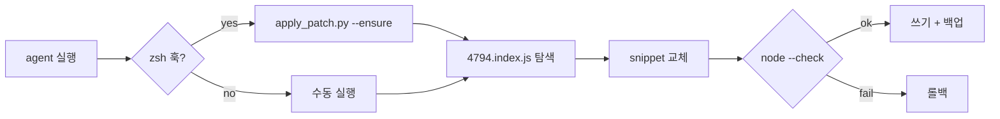

<p align="center">
  <a href="README.md">English</a> ·
  <a href="README.ko.md"><strong>한국어</strong></a> ·
  <a href="README.ja.md">日本語</a> ·
  <a href="README.zh-CN.md">简体中文</a> ·
  <a href="README.zh-TW.md">繁體中文</a>
</p>

<p align="center">
  
</p>

<h1 align="center">cursor-cli-input-patch</h1>

<p align="center">
  <strong><a href="https://cursor.com/docs/cli/overview">Cursor CLI</a> 유니코드 입력 패치</strong><br>
  <sub>단어 이동 · 빈 줄 스크롤 · 로컬 · 되돌리기 가능 · 비공식</sub>
</p>

<p align="center">
  <a href="LICENSE"></a>
  
  
  
</p>

<br>

> **명칭:** 제품명은 [**Cursor CLI**](https://cursor.com/cli), 실행 명령은 **`agent`** (`cursor-agent`는 legacy alias). 로컬 설치본만 패치하며 Cursor 바이너리는 포함하지 않습니다.

<table>
<tr>
<td width="50%" valign="top">

### 패치 전

**`agent`** 프롬프트에서:

- **Option/Alt + ← / →** (macOS) 또는 **Ctrl + ← / →** 가 `[A-Za-z0-9_]` 만 “단어”로 보고 나머지는 건너뜀
- 소프트 줄바꿈된 URL/경로 **위 빈 줄에서 ↑** 하면 스크롤이 튀고 줄바꿈된 행으로 커서 이동

</td>
<td width="50%" valign="top">

### 패치 후

- `Intl.Segmenter` (`granularity: "word"`, 런타임 기본 로케일)로 단어 경계
- 빈 줄·줄바꿈 EOL이 올바른 시각적 줄에 매핑 — 스크롤 점프 없음

</td>
</tr>
</table>

<p align="center">
  
</p>

<br>

## 어떤 언어·사용자에게 영향?

CJK 한정이 아닙니다:

| Fix | 영향 |
|:----|:-----|
| **Option/Ctrl + ← / →** | **`[A-Za-z0-9_]` 밖 문자** — 한·중·일, 키릴, 아랍, 히브리, 태국, 그리스, 데바나가리, 악센트 라틴(`café`) 등. 순수 ASCII 영어는 대체로 문제 없음. [Codex CLI](https://github.com/openai/codex/issues/16584), [Claude Code](https://github.com/anthropics/claude-code/issues/11099) 등 유사 이슈 |
| **줄바꿈된 긴 줄 위 빈 줄 ↑** | **언어 무관** — URL, 경로 등 soft-wrap + 위 빈 줄 |

한국어/CJK에서 시작했지만, word-motion 패치는 stock ASCII regex가 건너뛰는 **모든 문자体系**에 해당합니다.

<br>

## 빠른 시작

```bash
git clone https://github.com/vzts/cursor-cli-input-patch.git
cd cursor-cli-input-patch

python3 tests/test_behavior.py
python3 apply_patch.py
python3 apply_patch.py --install   # 선택: zsh 훅 (아래 참고)
```

패치 후 **`agent`** (또는 legacy **`cursor-agent`**) 세션을 재시작하세요.

<details>
<summary><strong>필요 환경</strong></summary>

<br>

- **Python 3**, **Node.js**, **macOS** (IDE worker 경로 기준)
- **Cursor CLI** 설치: `curl https://cursor.com/install -fsS | bash`
- **`--install`** — `~/.zshrc` 훅, `~/.local/bin` 래퍼, (macOS) CLI 업데이트 후 `--ensure`를 다시 도는 LaunchAgent. bash/fish도 래퍼·LaunchAgent는 동작; zsh 훅은 선택.

</details>

<br>

## 패치 대상

**`4794.index.js`** (텍스트 입력 번들)만 수정.

| | |
|:--|:--|
| **단어 이동** | ASCII helper → `Intl.Segmenter`, Option/Ctrl + 화살표 |
| **빈 줄** | `findLine` — 빈 줄·wrap EOL이 line 0으로 떨어지지 않음 |

디스크 경로(내부명 `cursor-agent`):

```
~/.local/share/cursor-agent/versions/<최신>/
~/Library/Application Support/Cursor/.../cursor-agent-worker/.../versions/<최신>/
```

`--no-worker`로 CLI만 패치 가능.

<br>

## 패치하지 않음

| 영역 | 이유 |
|:-----|:-----|
| 일반 **← / →** | NFC 한글은 UTF-16에서 음절 단위 — 패치 불필요 |
| **Backspace / Delete** (grapheme) | 동일 |
| CJK **표시 폭 ↑ / ↓** | 터미널 1칸/코드포인트, 폭 2 계산 오류 |
| **IME** 후보창 | 예전 패치가 `agent` 멈춤 — 제거·거부 |

터미널 커서를 **escape sequence로 움직이지 않습니다.**

<br>

## 명령어

```bash
python3 apply_patch.py              # CLI + worker 패치
python3 apply_patch.py --install    # zsh 훅 + ~/.local/bin 래퍼 + LaunchAgent
python3 apply_patch.py --ensure     # 완료 시 조용히; 래퍼 복구; 불일치 시 경고 후 exit 0
python3 apply_patch.py --restore    # .orig.bak 복원
python3 apply_patch.py --list-backups
python3 apply_patch.py --dry-run -v
python3 apply_patch.py --no-worker  # CLI만
```

<details>
<summary><strong>CLI 업데이트 · 백업 · 재설치</strong></summary>

<br>

업데이트 시 버전 폴더가 교체되고 `~/.local/bin/agent`가 symlink로 덮입니다.
**`--install`** 하면 LaunchAgent가 이를 감시해 `--ensure`(패치 + 래퍼 복구)를 다시 돌립니다.
`agent` / `cursor-agent` 실행 시 bin 래퍼도 `--ensure`를 호출합니다.

백업 — 버전당 원본 하나, 덮어쓰지 않음:

```
~/.local/share/cursor-cli-input-patch/backups/*.orig.bak
```

구 경로 `cursor-agent-cjk-input-patch`는 첫 실행 시 자동 이전.

미니파이 불일치 시 **fail closed**(에러 종료). **`--ensure`** 는 경고 후 `agent` 실행 허용. 최후 수단:

```bash
curl https://cursor.com/install -fsS | bash
```

</details>

<br>

## 동작 흐름



패턴은 특정 minify 형태에 고정 — Cursor가 바꾸면 추측하지 않습니다.

<br>

## 테스트

```bash
python3 tests/test_behavior.py
python3 tests/test_pty_arrows.py   # 패치된 CLI + PATH에 `agent` 필요
```

<br>

<p align="center">
  <sub>비공식 · Cursor와 무관 · <a href="LICENSE">MIT</a> © 2026 <a href="https://github.com/vzts">vzts</a></sub>
</p>
