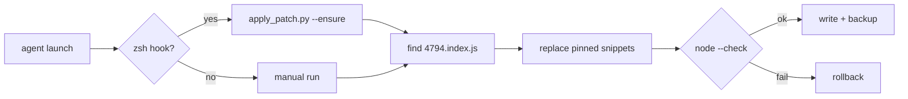

<p align="center">
  <a href="README.md"><strong>English</strong></a> ·
  <a href="README.ko.md">한국어</a> ·
  <a href="README.ja.md">日本語</a> ·
  <a href="README.zh-CN.md">简体中文</a> ·
  <a href="README.zh-TW.md">繁體中文</a>
</p>

<p align="center">
  
</p>

<h1 align="center">cursor-cli-input-patch</h1>

<p align="center">
  <strong>Unicode input fixes for <a href="https://cursor.com/docs/cli/overview">Cursor CLI</a></strong><br>
  <sub>word navigation · blank-line scroll · local · reversible · unofficial</sub>
</p>

<p align="center">
  <a href="LICENSE"></a>
  
  
  
</p>

<br>

> **Naming:** The product is [**Cursor CLI**](https://cursor.com/cli). You run **`agent`** (`cursor-agent` is a legacy alias). This repo patches your local install — it does **not** ship Cursor binaries.

<table>
<tr>
<td width="50%" valign="top">

### Before

In the **`agent`** prompt, two things feel wrong:

- **Option/Alt + ← / →** (macOS) or **Ctrl + ← / →** (Windows/Linux) only treats `[A-Za-z0-9_]` as “word” characters and skips the rest
- **↑** onto a blank line above a soft-wrapped URL/path scrolls away and snaps the caret to the wrapped row

</td>
<td width="50%" valign="top">

### After

Same keys, predictable behavior:

- Word jump uses `Intl.Segmenter` (`granularity: "word"`, runtime default locale)
- Blank lines and wrap end-of-line map to the correct visual row — no scroll jump

</td>
</tr>
</table>

<p align="center">
  
</p>

<br>

## Who is affected?

Not CJK-only — the two fixes have different scopes:

| Fix | Affected users |
|:----|:----------------|
| **Option/Ctrl + ← / →** | Text with characters **outside `[A-Za-z0-9_]`** — Korean, Japanese, Chinese, Cyrillic, Arabic, Hebrew, Thai, Greek, Devanagari, Latin with accents (`café`), etc. Mostly fine for plain ASCII English. Same class of bug in other TUIs ([Codex CLI](https://github.com/openai/codex/issues/16584), [Claude Code](https://github.com/anthropics/claude-code/issues/11099)). |
| **↑ on a blank line** above a wrapped row | **Language-agnostic** — long URLs, file paths, or any soft-wrapped line with empty rows above. |

Built around Korean/CJK pain points; the word-motion patch helps **any script** the stock ASCII regex skips.

<br>

## Quick start

```bash
git clone https://github.com/vzts/cursor-cli-input-patch.git
cd cursor-cli-input-patch

python3 tests/test_behavior.py   # no Cursor install needed
python3 apply_patch.py           # latest CLI + IDE worker
python3 apply_patch.py --install # optional: zsh hook + bin wrappers + LaunchAgent
```

Restart **`agent`** (or **`cursor-agent`** if you still use that alias) after patching.

<details>
<summary><strong>Requirements</strong></summary>

<br>

- **Python 3** — runs the patcher
- **Node.js** — `node --check` before writing
- **macOS** — install paths (especially the IDE worker copy) match Cursor’s layout today
- **Cursor CLI** — already installed: `curl https://cursor.com/install -fsS | bash`
- **`--install`** — writes `~/.zshrc` hook, durable `~/.local/bin` wrappers, and (macOS) a LaunchAgent that re-runs `--ensure` after CLI updates. Bash/fish: wrappers + LaunchAgent still work; zsh hook is optional.

</details>

<br>

## What it patches

Only **`4794.index.js`** — the text-input bundle in your existing install.

| | |
|:--|:--|
| **Word motion** | ASCII-only helpers → `Intl.Segmenter` for Option/Ctrl + arrow |
| **Empty lines** | `findLine` fix — blank rows and wrap EOL no longer fall back to line 0 |

Auto-targets (on-disk paths still use the `cursor-agent` name):

```
~/.local/share/cursor-agent/versions/<latest>/
~/Library/Application Support/Cursor/.../cursor-agent-worker/.../versions/<latest>/
```

Use `--no-worker` to patch the CLI copy only.

<br>

## What it deliberately skips

| Area | Reason |
|:-----|:-------|
| Plain **← / →** | NFC Hangul is already one UTF-16 code unit per syllable; no patch needed |
| **Backspace / Delete** (grapheme) | Same |
| CJK **display-width ↑ / ↓** | Terminal caret is 1 column per code point; width-2 math lands on the wrong glyph |
| **IME** candidate window | An older reposition patch hung `agent` — removed and refused |

The patcher **never** moves the terminal cursor with escape sequences.

<br>

## Commands

```bash
python3 apply_patch.py              # patch CLI + worker
python3 apply_patch.py --install    # zsh hook + ~/.local/bin wrappers + LaunchAgent
python3 apply_patch.py --ensure     # quiet if done; repair wrappers; warn and exit 0 on mismatch
python3 apply_patch.py --restore    # rollback from .orig.bak
python3 apply_patch.py --list-backups
python3 apply_patch.py --dry-run -v # preview / verbose
python3 apply_patch.py --no-worker  # CLI only
```

<details>
<summary><strong>After a CLI update · backups · reinstall</strong></summary>

<br>

Cursor updates replace the version folder and rewrite `~/.local/bin/agent` as a symlink.
With **`--install`**, a LaunchAgent watches those paths and re-runs `--ensure` (patch + restore wrappers).
Launching `agent` / `cursor-agent` also runs `--ensure` via the bin wrappers.

Backups — one pristine original per version, never overwritten:

```
~/.local/share/cursor-cli-input-patch/backups/*.orig.bak
```

Older clones used `~/.local/share/cursor-agent-cjk-input-patch/backups/` — moved on first run.

If a future minify no longer matches, the patcher **fails closed** (exits with an error). With **`--ensure`**, it prints a warning and still lets `agent` start. Last resort:

```bash
curl https://cursor.com/install -fsS | bash
```

</details>

<br>

## How it works



Patterns are pinned to a specific minified shape — the patcher refuses to guess if Cursor re-minifies differently.

<br>

## Tests

```bash
python3 tests/test_behavior.py    # portable; no Cursor install
python3 tests/test_pty_arrows.py  # live TUI over PTY; needs patched CLI + `agent` on PATH
```

<br>

<p align="center">
  <sub>Unofficial · not affiliated with Cursor · <a href="LICENSE">MIT</a> © 2026 <a href="https://github.com/vzts">vzts</a></sub>
</p>
