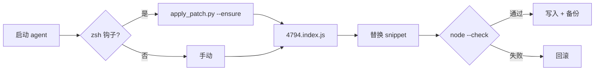

<p align="center">
  <a href="README.md">English</a> ·
  <a href="README.ko.md">한국어</a> ·
  <a href="README.ja.md">日本語</a> ·
  <a href="README.zh-CN.md"><strong>简体中文</strong></a> ·
  <a href="README.zh-TW.md">繁體中文</a>
</p>

<p align="center">
  
</p>

<h1 align="center">cursor-cli-input-patch</h1>

<p align="center">
  <strong><a href="https://cursor.com/docs/cli/overview">Cursor CLI</a> Unicode 输入补丁</strong><br>
  <sub>按词移动 · 空行滚动 · 本地 · 可撤销 · 非官方</sub>
</p>

<p align="center">
  <a href="LICENSE"></a>
  
  
  
</p>

<br>

> **命名：** 官方产品名为 [**Cursor CLI**](https://cursor.com/cli)，运行命令为 **`agent`**（`cursor-agent` 为旧别名）。仅补丁本地安装，不包含 Cursor 二进制。

<table>
<tr>
<td width="50%" valign="top">

### 补丁前

**`agent`** 提示符中:

- **Option/Alt + ← / →**（macOS）或 **Ctrl + ← / →** 仅将 `[A-Za-z0-9_]` 视为“词”
- 在软换行 URL/路径 **上方空行按 ↑** 会滚动跳动

</td>
<td width="50%" valign="top">

### 补丁后

- `Intl.Segmenter`（`granularity: "word"`, 运行时默认 locale）
- 空行与换行 EOL 映射到正确的视觉行

</td>
</tr>
</table>

<p align="center">
  
</p>

<br>

## 影响哪些语言？

不限于 CJK：

| Fix | 影响 |
|:----|:-----|
| **Option/Ctrl + ← / →** | **`[A-Za-z0-9_]` 以外** — 韩/日/中、西里尔、阿拉伯、希伯来、泰语、希腊、天城文、带重音拉丁（`café`）等。纯 ASCII 英文通常无感。[Codex CLI #16584](https://github.com/openai/codex/issues/16584) 等同类问题 |
| **换行行长行上方空行 ↑** | **与语言无关** — URL、路径等 soft-wrap + 上方空行 |

源于韩语/CJK 痛点，但按词移动补丁适用于 stock ASCII 正则跳过的 **所有文字体系**。

<br>

## 快速开始

```bash
git clone https://github.com/vzts/cursor-cli-input-patch.git
cd cursor-cli-input-patch
python3 tests/test_behavior.py
python3 apply_patch.py
python3 apply_patch.py --install   # 可选：zsh 钩子
```

补丁后重启 **`agent`**（或旧别名 **`cursor-agent`**）。

<details>
<summary><strong>环境要求</strong></summary>

<br>

- **Python 3**、**Node.js**、**macOS**（IDE worker 路径）
- 已安装 **Cursor CLI**：`curl https://cursor.com/install -fsS | bash`
- **`--install`** — **仅 zsh**（写入 `~/.zshrc`）。bash/fish 请手动运行

</details>

<br>

## 补丁内容

仅 **`4794.index.js`**。

| | |
|:--|:--|
| **按词移动** | ASCII helper → `Intl.Segmenter` |
| **空行** | 修复 `findLine` |

```
~/.local/share/cursor-agent/versions/<最新>/
~/Library/Application Support/Cursor/.../cursor-agent-worker/.../versions/<最新>/
```

`--no-worker` 仅补丁 CLI。

<br>

## 故意不补丁

| 范围 | 原因 |
|:-----|:-----|
| 普通 **← / →** | NFC 韩文已是 UTF-16 一音节 — 无需补丁 |
| **Backspace / Delete**（grapheme） | 同上 |
| CJK **显示宽度 ↑ / ↓** | 每码点 1 列，宽度 2 计算错误 |
| **IME** 候选窗 | 旧补丁导致 `agent` 挂起 — 已移除 |

**不会**用转义序列移动终端光标。

<br>

## 命令

```bash
python3 apply_patch.py              # CLI + worker
python3 apply_patch.py --install    # zsh 钩子 + ~/.local/bin 包装脚本 + LaunchAgent
python3 apply_patch.py --ensure     # 已完成则静默；修复包装脚本；不匹配则警告后 exit 0
python3 apply_patch.py --restore
python3 apply_patch.py --list-backups
python3 apply_patch.py --dry-run -v
python3 apply_patch.py --no-worker
```

<details>
<summary><strong>CLI 更新 · 备份 · 重装</strong></summary>

<br>

更新会替换版本目录并把 `~/.local/bin/agent` 改回 symlink。**`--install`** 后 LaunchAgent 会再跑 `--ensure`（打补丁 + 恢复包装脚本）。启动 `agent` 时 bin 包装脚本也会调用 `--ensure`。备份：`~/.local/share/cursor-cli-input-patch/backups/`（旧路径首次自动迁移）。

不匹配时 **fail closed**。**`--ensure`** 警告后仍允许启动 `agent`。最后手段：`curl https://cursor.com/install -fsS | bash`

</details>

<br>

## 工作流程



<br>

## 测试

```bash
python3 tests/test_behavior.py
python3 tests/test_pty_arrows.py   # 需已补丁 CLI + PATH 中有 agent
```

<br>

<p align="center">
  <sub>非官方 · 与 Cursor 无关 · <a href="LICENSE">MIT</a> © 2026 <a href="https://github.com/vzts">vzts</a></sub>
</p>
