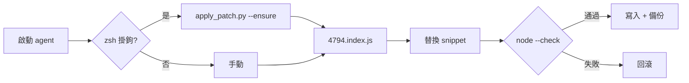

<p align="center">
  <a href="README.md">English</a> ·
  <a href="README.ko.md">한국어</a> ·
  <a href="README.ja.md">日本語</a> ·
  <a href="README.zh-CN.md">简体中文</a> ·
  <a href="README.zh-TW.md"><strong>繁體中文</strong></a>
</p>

<p align="center">
  
</p>

<h1 align="center">cursor-cli-input-patch</h1>

<p align="center">
  <strong><a href="https://cursor.com/docs/cli/overview">Cursor CLI</a> Unicode 輸入修補</strong><br>
  <sub>依詞移動 · 空行捲動 · 本機 · 可還原 · 非官方</sub>
</p>

<p align="center">
  <a href="LICENSE"></a>
  
  
  
</p>

<br>

> **命名：** 官方產品名為 [**Cursor CLI**](https://cursor.com/cli)，執行命令為 **`agent`**（`cursor-agent` 為舊別名）。僅修補本機安裝，不含 Cursor 二進位檔。

<table>
<tr>
<td width="50%" valign="top">

### 修補前

**`agent`** 提示符中:

- **Option/Alt + ← / →**（macOS）或 **Ctrl + ← / →** 僅將 `[A-Za-z0-9_]` 視為「詞」
- 在軟換行 URL/路徑 **上方空行按 ↑** 會捲動跳動

</td>
<td width="50%" valign="top">

### 修補後

- `Intl.Segmenter`（`granularity: "word"`, 執行時預設 locale）
- 空行與換行 EOL 對應到正確的視覺行

</td>
</tr>
</table>

<p align="center">
  
</p>

<br>

## 影響哪些語言？

不限 CJK：

| Fix | 影響 |
|:----|:-----|
| **Option/Ctrl + ← / →** | **`[A-Za-z0-9_]` 以外** — 韓/日/中、西里爾、阿拉伯、希伯來、泰語、希臘、天城文、帶重音拉丁（`café`）等。純 ASCII 英文通常無感。[Codex CLI #16584](https://github.com/openai/codex/issues/16584) 等同類問題 |
| **換行長行上方空行 ↑** | **與語言無關** — URL、路徑等 soft-wrap + 上方空行 |

源於韓語/CJK 痛點，但依詞移動修補適用於 stock ASCII 正則跳過的 **所有文字體系**。

<br>

## 快速開始

```bash
git clone https://github.com/vzts/cursor-cli-input-patch.git
cd cursor-cli-input-patch
python3 tests/test_behavior.py
python3 apply_patch.py
python3 apply_patch.py --install   # 選用：zsh 掛鉤
```

修補後重新啟動 **`agent`**（或舊別名 **`cursor-agent`**）。

<details>
<summary><strong>環境需求</strong></summary>

<br>

- **Python 3**、**Node.js**、**macOS**（IDE worker 路徑）
- 已安裝 **Cursor CLI**：`curl https://cursor.com/install -fsS | bash`
- **`--install`** — **僅 zsh**（寫入 `~/.zshrc`）。bash/fish 請手動執行

</details>

<br>

## 修補內容

僅 **`4794.index.js`**。

| | |
|:--|:--|
| **依詞移動** | ASCII helper → `Intl.Segmenter` |
| **空行** | 修正 `findLine` |

```
~/.local/share/cursor-agent/versions/<最新>/
~/Library/Application Support/Cursor/.../cursor-agent-worker/.../versions/<最新>/
```

`--no-worker` 僅修補 CLI。

<br>

## 故意不修補

| 範圍 | 原因 |
|:-----|:-----|
| 一般 **← / →** | NFC 韓文已是 UTF-16 一音節 — 無需修補 |
| **Backspace / Delete**（grapheme） | 同上 |
| CJK **顯示寬度 ↑ / ↓** | 每碼點 1 欄，寬度 2 計算錯誤 |
| **IME** 候選窗 | 舊修補導致 `agent` 停住 — 已移除 |

**不會**用跳脫序列移動終端機游標。

<br>

## 命令

```bash
python3 apply_patch.py              # CLI + worker
python3 apply_patch.py --install    # zsh 掛鉤 + ~/.local/bin 包裝腳本 + LaunchAgent
python3 apply_patch.py --ensure     # 已完成則靜默；修復包裝腳本；不匹配則警告後 exit 0
python3 apply_patch.py --restore
python3 apply_patch.py --list-backups
python3 apply_patch.py --dry-run -v
python3 apply_patch.py --no-worker
```

<details>
<summary><strong>CLI 更新 · 備份 · 重裝</strong></summary>

<br>

更新會替換版本目錄並把 `~/.local/bin/agent` 改回 symlink。**`--install`** 後 LaunchAgent 會再跑 `--ensure`（套用修補 + 還原包裝腳本）。啟動 `agent` 時 bin 包裝腳本也會呼叫 `--ensure`。備份：`~/.local/share/cursor-cli-input-patch/backups/`（舊路徑首次自動遷移）。

不匹配時 **fail closed**。**`--ensure`** 警告後仍允許啟動 `agent`。最後手段：`curl https://cursor.com/install -fsS | bash`

</details>

<br>

## 工作流程



<br>

## 測試

```bash
python3 tests/test_behavior.py
python3 tests/test_pty_arrows.py   # 需已修補 CLI + PATH 中有 agent
```

<br>

<p align="center">
  <sub>非官方 · 與 Cursor 無關 · <a href="LICENSE">MIT</a> © 2026 <a href="https://github.com/vzts">vzts</a></sub>
</p>
